# Event Detection Review

Comprehensive end-to-end review of AirAutomatica's event and detection pipeline from a system-level aviation perspective. Fixed-wing UAV/RC companion-computer context.

---

## 1. Current System Map

```mermaid
flowchart TB
    subgraph OneShot [AI HAT One-Shot]
        A1[POST /api/ai/detect] --> A2[HailoAiHatProvider]
        A2 --> A3[AiDetectionStore cache]
        A2 --> A4[normalize_detections_to_events]
        A4 --> A5[insert_detection per detection]
        A4 --> A6[insert_system_event person_detected]
    end

    subgraph Recording [Recording-Time AI]
        B1[RecordingAiIngest _tick] --> B2[ffmpeg extract frame]
        B2 --> B3[Hailo inference]
        B3 --> B4[insert_detection ai_hat_recording]
    end

    subgraph Mission [Mission Flow]
        C1[MissionLogic.run] --> C2[ai_service.infer]
        C2 --> C3[process_result]
        C3 --> C4[insert_detection mock/ollama/aihat]
    end

    subgraph System [System Events]
        D1[TelemetryLifecycleLogger] --> D2[insert_system_event telemetry_status_transition]
        D3[main _shutdown_cleanup] --> D4[insert_system_event app_shutdown]
        D5[main _capability_callback] --> D6[insert_system_event capability_profile_set]
    end

    subgraph UI [UI Surfaces]
        E1[Recent Detections] --> E2[detections_update Socket.IO]
        E3[Recent Events] --> E4[events_update Socket.IO]
        E2 --> E5[get_recent_detections]
        E4 --> E6[get_recent_system_events]
    end
```

---

## 2. Event Source Inventory

| Source | Purpose | Trigger | Output Type | Persistence | UI Surface | Audience |
|--------|---------|---------|-------------|-------------|------------|----------|
| AI HAT one-shot | On-demand perception | POST /api/ai/detect | DetectionResult, DetectionEvent | detections (aihat), system_events (person_detected) | Recent Detections, AI HAT last one-shot | Operator |
| AI HAT recording-time | Continuous perception during recording | RecordingAiIngest loop | DetectionResult | detections (ai_hat_recording) | Recent Detections | Operator |
| Mission logic | Telemetry-driven perception | MissionLogic.run (10s interval) | AiResult | detections (mock/ollama/aihat) | Recent Detections | Operator / mission-context |
| TelemetryLifecycleLogger | Connection state changes | TelemetryPreprocessor on_state | — | system_events | Recent Events | Internal |
| main _shutdown_cleanup | App shutdown | atexit / signal | — | system_events | Recent Events | Internal |
| main _capability_callback | Serial capability profile | CapabilityInfo from telemetry | — | system_events | Recent Events | Internal |
| EventPersistenceRecorder | Flight events (battery_sag, gps_degraded, etc.) | TelemetryPreprocessor | — | flight_events | Session replay timeline | Operator |
| PhasePersistenceRecorder | Flight phase intervals | TelemetryPreprocessor | — | phase_intervals | Session replay timeline | Operator |

---

## 3. Strengths

- **Clear boundaries:** AI HAT optional; one-shot distinct from recording-time; diagnostics distinct from health.
- **source_backend:** All persisted detections carry source (aihat, ai_hat_recording, mock, ollama).
- **Session association:** Detections require session_id; session-scoped retrieval.
- **Persistence model:** SQLite detections table with label, confidence, summary, lat/lon/rel_alt_m, metadata_json.
- **Event normalization:** _LABEL_TO_EVENT maps raw labels to person_detected, vehicle_detected, aircraft_detected, object_detected.
- **Deduplication:** Mission logic and RecordingAiIngest both use time-window dedupe (30s).
- **Mission logic telemetry context:** Mission flow passes state.lat, state.lon, state.rel_alt_m to insert_detection.

---

## 4. Weaknesses / Gaps

- **person_detected dual persistence:** One-shot inserts both detection row and system_event. Semantically overlapping but intentional (see Evidence vs Notification).
- **get_recent_system_events:** No session filter; returns global events. Some events (app_shutdown) are correctly global; others may benefit from session scoping. Deferred.
- **Recording AI no telemetry context:** RecordingAiIngest passes lat=None, lon=None, rel_alt_m=None. Mission logic passes state; recording does not. High-value fix.
- **source_backend raw in UI:** Detection cards show "aihat", "ai_hat_recording" — not human-friendly. Fixed by fmtSourceBackend.
- **ai_hat_scope.md stale:** Claims "no structured events or persistence from the recording pipeline yet" — RecordingAiIngest persists when RECORDING_AI_PERSIST_ENABLED=1.
- **Operator context:** Detection cards expose confidence, timestamp, event_type, source_backend, lat/lon. Source_backend was raw; now human-friendly. Lat/lon missing for recording-time until 4.2.

---

## 5. Evidence vs Notification

**Explicit semantic distinction:**

- **Detection row** = evidence record. Durable, session-linked, queryable. Used for session review, mission understanding, future flight-review workflows.
- **System event** = operator notification. Quick visibility in Recent Events, log-style. person_detected system event is intentional — operators see "Person detected (AI HAT one-shot)" in Recent Events while the same evidence is also stored as a detection row.

Do not remove the person_detected system event as "duplication." It is dual persistence by design.

---

## 6. Recommended Changes

1. **Source backend human labels (4.1)** — Implemented. fmtSourceBackend maps aihat → "AI HAT one-shot", ai_hat_recording → "AI HAT recording", etc.
2. **Update ai_hat_scope.md (4.4)** — Implemented. Reflect recording-time persistence.
3. **Recent Detections subtitle (4.5)** — Implemented. Clearer wording.
4. **Telemetry context for recording AI (4.2)** — Implemented. Inject get_state; pass lat/lon/rel_alt_m when available.
5. **Session filter for system events (4.6)** — Deferred. Global events may be intentional; keep deferred unless caller audit is trivial.

---

## 7. Implemented Changes (This Pass)

- **4.1:** Added fmtSourceBackend to formatters.js; detection cards in dashboard.html and session_detail.html use human-friendly source labels.
- **4.4:** Updated docs/ai_hat_scope.md: recording-time persistence with ai_hat_recording; added row to Persisted detection history table.
- **4.5:** Recent Detections subtitle: "Mission-flow (Ollama/mock) and AI HAT recording-time detections. Source shown per card."
- **4.2:** RecordingAiIngest accepts optional get_state callback; CameraRecordingService passes store.get; recording-time detections now carry lat/lon/rel_alt_m when telemetry available.
- **Confidence-aware persistence:** RECORDING_AI_PERSIST_THRESHOLD (default 0.5). Persist when confidence >= threshold (inclusive). Stricter than inference threshold; keeps Recent Detections credible.

---

## 8. Deferred Recommendations

- **Session filter for get_recent_system_events:** Keep deferred. Global events (app_shutdown, capability_profile_set) are correct. If session-scoped events are needed, add optional session_id param after caller audit.
- **Event batching / rate limiting:** If recording-time produces many detections, consider batching or stricter dedupe.
- **"Interesting event" promotion:** Future: promote high-confidence aircraft_detected or person_detected to higher-visibility operator alerts.

---

## 9. Final Summary

### Major findings

- Three detection persistence paths: one-shot (aihat), recording-time (ai_hat_recording), mission flow (mock/ollama/aihat). All use `detections` table with `source_backend`.
- person_detected dual persistence (detection + system_event) is intentional: evidence vs operator notification.
- Recording-time detections lacked telemetry context (lat/lon/rel_alt_m); mission flow had it. Now aligned.
- UI showed raw source_backend values; operator clarity improved with human-friendly labels.

### Major risks / gaps

- `get_recent_system_events` returns global events; no session filter. Deferred; some events (app_shutdown) correctly global.
- Mock mission flow reachable when `AI_MODE=mock`; not a production path when aihat/ollama.

### What was improved

- **4.1:** fmtSourceBackend maps aihat → "AI HAT one-shot", ai_hat_recording → "AI HAT recording", mock → "Mission (mock)", ollama → "Mission (Ollama)".
- **4.4:** docs/ai_hat_scope.md updated: recording-time persistence, expanded Persisted detection history table.
- **4.5:** Recent Detections subtitle: "Mission-flow (Ollama/mock) and AI HAT recording-time detections. Source shown per card."
- **4.2:** RecordingAiIngest accepts optional get_state; CameraRecordingService passes store.get(); recording-time detections now carry lat/lon/rel_alt_m when telemetry available.
- **Confidence-aware persistence:** RECORDING_AI_PERSIST_THRESHOLD (default 0.5); persist when confidence >= threshold. Startup log includes persist_threshold for debugging.

### What should come next

- Consider session filter for get_recent_system_events if operator workflows need session-scoped events.
- Event batching or rate limiting if recording produces many detections.
