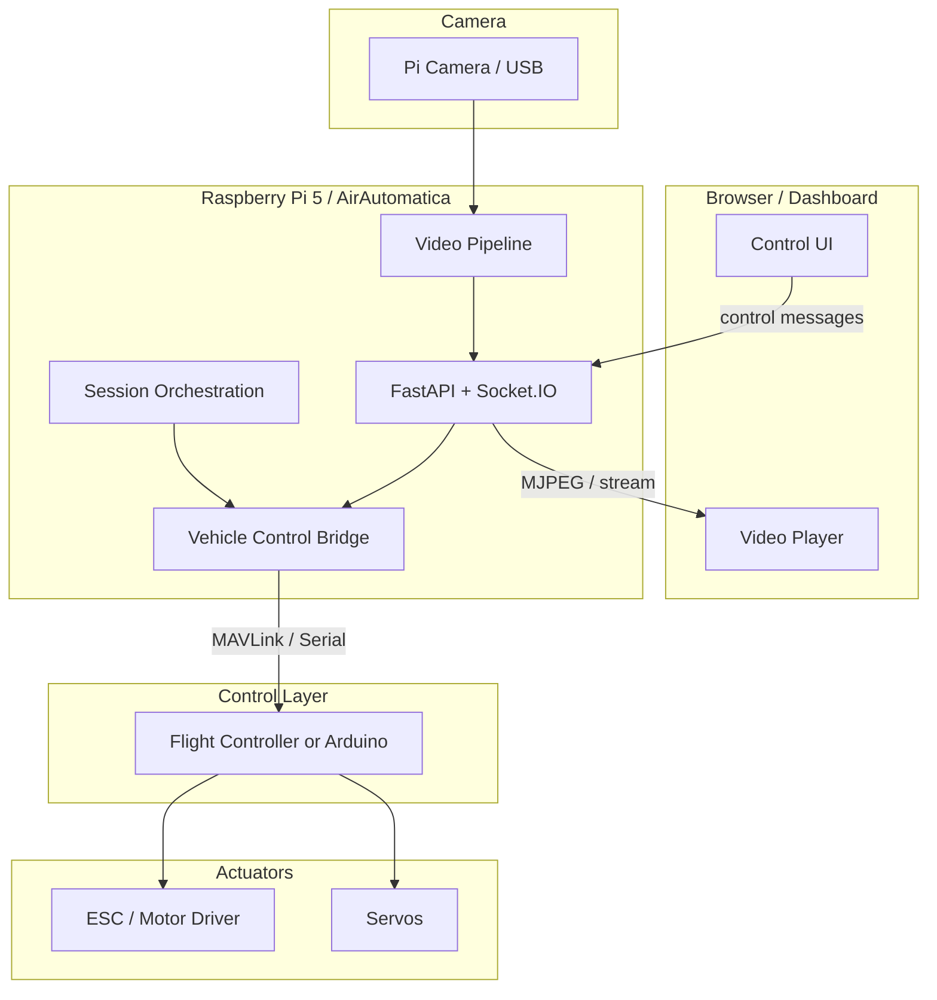
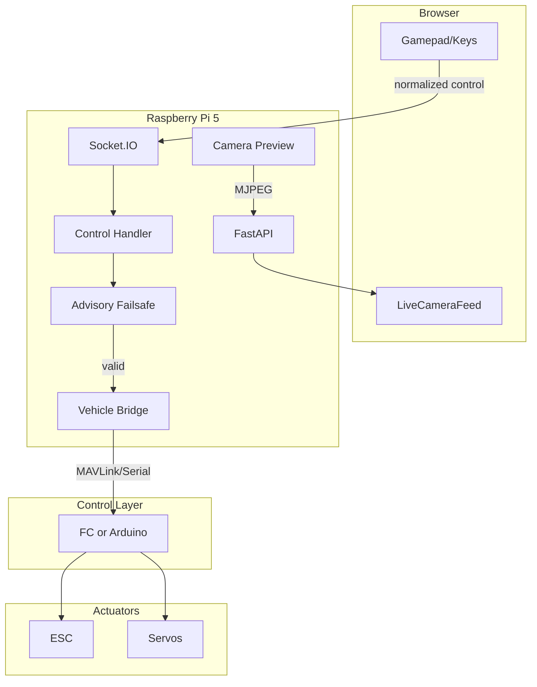

# Hybrid AirAutomatica Vehicle Platform

## Overall Goal

Build a hybrid AirAutomatica platform with **mode-aware UI and startup**, where:

- **Raspberry Pi 5** handles: networking, video, dashboard/server logic, session orchestration, and high-level commands
- **Flight controller or Arduino/motor-driver layer** handles: deterministic vehicle control, PWM/output timing, and failsafe behavior

The system supports:

- `drone` mode — ArduPilot/MAVLink telemetry, flight path, read-only dashboard
- `rover` mode — Teleoperated ground vehicle with live video and bidirectional control
- `bench` mode — Safe testing without live actuators (mock control, no motion)

LTE-Car is used as **inspiration only**: standby/driver split, bidirectional telepresence, browser control abstraction, mode-based startup. The implementation is a modern, robust design for AirAutomatica, not a literal copy of LTE-Car.

---

## Critical Architectural Principles

### 1. Pi 5 Is Not the Real-Time Actuator Controller

The Raspberry Pi 5 must **not** be the primary real-time actuator controller. It should not be responsible for mission-critical steering/throttle timing. Do not center rover control around direct Pi GPIO output for primary motion control.

### 2. No pigpio-Based Direct Control as Primary Design

The old LTE-Car pattern of direct Pi GPIO motor/servo driving is **not** the desired long-term design. If GPIO is mentioned at all, it is a limited experiment, test path, or fallback — not the main system design.

### 3. Two-Layer Architecture

| Layer | Responsibilities |
|-------|------------------|
| **Pi 5 / AirAutomatica** | Dashboard server, networking, video streaming, session management, standby/driver orchestration, telemetry aggregation, high-level command/control messages |
| **Control layer (FC or Arduino)** | Steering, throttle, deterministic output timing, watchdogs, neutral-on-loss behavior, failsafe / arm-enable gating |

### 4. Control and Video Paths Are Separate

Video failure must **not** block control failsafe behavior. Telepresence is important, but safety/control must not depend on video being alive. Control logic runs independently of the video pipeline.

### 5. LTE-Car as Reference Only

Keep architectural ideas that make sense (standby/driver, bidirectional control, mode-based startup). Replace outdated or fragile implementation assumptions with a robust modern structure.

### 6. Control Ownership / Priority

Only **one control owner** may command the vehicle at a time. Candidate owners include: browser teleop, manual radio, API, or future autonomy logic. Ownership transitions must be **explicit and observable** in telemetry/status. On owner heartbeat loss, the system must revert to a safe state or to the configured manual recovery path.

### 7. Authoritative Failsafe

Pi-side failsafe logic is **advisory**: it should stop command forwarding when stale or invalid input is detected. The **authoritative** neutral-on-loss and watchdog behavior must live in the control layer (flight controller or Arduino motor-control layer). The Pi does not enforce safety; it stops sending commands when it detects problems. The control layer enforces safety regardless of Pi state.

### 8. Manual Recovery Path

When an RC/manual link is present, it should remain the **preferred recovery/control path** unless explicitly overridden by system design. Manual radio takes precedence on loss of other control sources, unless the system is explicitly configured otherwise.

---

## Refined Architecture



**Key points:**

- **Browser / Dashboard** — Vue 3 SPA, gamepad/keyboard input, mode-aware panels
- **AirAutomatica server on Pi 5** — FastAPI, Socket.IO, session logic, video serving
- **Vehicle control bridge** — Normalized control messages → FC/Arduino protocol
- **Flight controller or Arduino** — Deterministic PWM, watchdogs, failsafe
- **Motor driver / ESC / servos** — Hardware outputs
- **Camera / video pipeline** — Existing MJPEG or future H.264; logically separate from control

The Pi 5 is the **companion/network/video computer**, not the deterministic motion-control device.

---

## Vehicle Modes

| Mode | Description |
|------|--------------|
| `drone` | ArduPilot/MAVLink telemetry, flight path, aircraft state, read-only dashboard. No rover control. |
| `rover` | Teleoperated ground vehicle. Live video, gamepad control, rover telemetry. Commands flow Pi → bridge → FC/Arduino. |
| `bench` | Safe testing without live actuators. Mock control backend, no motion. Validates UI, control contract, and session logic. |

---

## Normalized Control Contract

Rover teleoperation uses a **generic, future-friendly** control message design, not tightly coupled to LTE-Car's original payload shape.

### Control Message Schema

```python
{
    "timestamp": "2025-03-19T12:00:00.000Z",  # ISO 8601
    "seq": 42,                                 # Monotonic sequence number
    "steering": -0.5,                          # -1.0 (left) to 1.0 (right)
    "throttle": 0.3,                           # -1.0 (reverse) to 1.0 (forward)
    "pan": 0.0,                                # Optional camera pan (-1 to 1)
    "tilt": 0.0,                               # Optional camera tilt (-1 to 1)
    "source": "gamepad",                       # gamepad | keyboard | api
    "mode": "rover"                            # rover | bench
}
```

### Design Rationale

- **timestamp** — For latency measurement and ordering
- **seq** — Detect drops, enforce ordering
- **steering / throttle** — Normalized floats; backend maps to protocol
- **pan / tilt** — Optional; camera gimbal if supported
- **source** — Audit trail
- **mode** — Ensures bench never drives real actuators

---

## Safety and Failsafe (Mandatory)

These are **core requirements**, not future niceties.

| Requirement | Description |
|-------------|-------------|
| **Command timeout to neutral** | If no valid command received within N ms (e.g. 500 ms), output neutral/stop. |
| **Heartbeat / watchdog** | Control layer expects periodic heartbeat; loss triggers neutral. |
| **Manual stop** | Dashboard and API must expose an explicit stop/emergency-stop. |
| **Arm / enable gate** | Optional: require explicit arm before motion; default disarmed. |
| **Deadband and clamping** | Normalize inputs: deadband near zero, clamp to [-1, 1]. |
| **Clean startup** | System starts in neutral/stopped state; no motion until explicitly enabled. |

**Authoritative vs advisory:** Control logic and failsafe behavior run on the **control layer** (FC/Arduino). The Pi 5 sends high-level commands; the control layer enforces timing and safety. Pi-side failsafe is **advisory** — it stops sending commands when it detects problems. The control layer enforces safety regardless of Pi state.

---

## Revised Vehicle Subsystem Design

The rover subsystem is **not** Pi GPIO direct drive. It is a layered control design:

| Module | Purpose |
|--------|---------|
| `control.py` | Normalized control message handling, validation, deadband, clamping. Receives from Socket.IO/REST, emits to bridge. |
| `failsafe.py` | **Advisory** timeout logic, heartbeat tracking. Stops command forwarding when stale/invalid. Does not enforce safety; control layer is authoritative. |
| `backends/mavlink.py` | Send rover commands via MAVLink (e.g. MANUAL_CONTROL, RC_CHANNELS_OVERRIDE). |
| `backends/arduino_serial.py` | Send commands over serial to Arduino motor controller. |
| `backends/mock.py` | Bench mode: accept commands, no hardware output. |
| `telemetry.py` | Rover telemetry aggregation (battery, RSSI, FC status). |
| Video | Reuse existing camera preview; no new video module for rover. |

**No** `control.py` = pigpio. **No** `driver.py` = direct GPIO orchestration.

---

## Transport Recommendations

For **home network** use:

| Path | Recommendation |
|------|----------------|
| **Control and state** | Socket.IO / WebSocket |
| **Video** | Existing camera/video pipeline (MJPEG HTTP or similar) |
| **Pi ↔ control layer** | Serial and/or MAVLink |
| **LTE / public network** | Not required yet; can come later by changing transport, not architecture |

LTE/public-network support is a **transport change** (e.g. relay, tunnel), not an architectural redesign.

---

## Mode-Aware Dashboard

| Mode | Panels Shown |
|------|--------------|
| `drone` | Flight path, aircraft state, trends, detections, sessions, camera (read-only) |
| `rover` | Live camera (prominent), vehicle control (gamepad/keyboard), rover status, telemetry |
| `bench` | Same as rover but with "BENCH MODE" indicator; no live actuators |

**Implementation:** Add `vehicle_mode` to health payload. DashboardLiveView.vue uses `v-if` / `v-else-if` on `vehicleMode`. `VehicleControl.vue` captures gamepad/keyboard and emits normalized control messages via Socket.IO.

---

## Revised File Plan

| File | Action |
|------|--------|
| `src/airautomatica/vehicle/control.py` | Create — Normalized control message handling |
| `src/airautomatica/vehicle/failsafe.py` | Create — Advisory timeout, heartbeat; stop forwarding when stale |
| `src/airautomatica/vehicle/backends/mavlink.py` | Create — MAVLink rover command bridge |
| `src/airautomatica/vehicle/backends/arduino_serial.py` | Create — Serial bridge to Arduino |
| `src/airautomatica/vehicle/backends/mock.py` | Create — Bench mode mock backend |
| `src/airautomatica/vehicle/telemetry.py` | Create — Rover telemetry aggregation |
| `src/airautomatica/api/routers/vehicle.py` | Create — REST + Socket.IO bridge |
| `frontend/src/components/VehicleControl.vue` | Create — Gamepad/keyboard UI |
| `frontend/src/stores/vehicle.ts` | Create — Vehicle state |
| `src/airautomatica/settings.py` | Modify — Add VEHICLE_MODE, VEHICLE_* keys |
| `frontend/src/constants/settings.ts` | Modify — Add VEHICLE_MODE |
| `src/airautomatica/main.py` | Modify — Conditional startup by mode |

**Not included:** Direct GPIO control modules. No pigpio-based `driver.py` for primary motion.

---

## Implementation Phases

### Phase 1: Mode Framework and UI/Backend Conditional Startup

- Add `VEHICLE_MODE` = `drone` | `rover` | `bench` to settings
- Conditional startup in main.py: load telemetry for drone, vehicle subsystem for rover/bench
- Add `vehicle_mode` to health payload
- Dashboard: mode-aware panel rendering (`v-if` / `v-else-if`)

### Phase 2: Normalized Rover Control Contract

- Define control message schema (timestamp, seq, steering, throttle, pan, tilt, source, mode)
- `VehicleControl.vue`: gamepad/keyboard capture, emit normalized messages
- `vehicle/control.py`: receive, validate, apply deadband/clamping
- Socket.IO handler: `vehicle_control` event

### Phase 3: Backend Controller Bridge Abstraction

- `vehicle/backends/base.py`: abstract interface (send_command, get_status)
- `vehicle/backends/mock.py`: bench mode implementation
- `vehicle/backends/mavlink.py`: MAVLink rover commands (when FC supports)
- `vehicle/backends/arduino_serial.py`: serial protocol (when Arduino used)
- Bridge selects backend based on mode and config

### Phase 4: Failsafe / Watchdog Rules

- `vehicle/failsafe.py`: advisory command timeout, heartbeat tracking; stop forwarding when stale
- Integrate with bridge: stop sending commands when failsafe triggers
- Manual stop API and UI button
- Optional arm/enable gate
- Control layer (FC/Arduino) implements authoritative neutral-on-loss

### Phase 5: Video / Control Integration for Telepresence

- Reuse existing camera preview for rover
- Ensure video and control paths remain logically separate
- End-to-end telepresence: browser → control → video

### Phase 6: Future LTE / Public-Network Adaptation

- Transport layer change: relay, tunnel, or UDP bridge
- No architectural redesign; control contract and bridge unchanged

---

## Data Flow (Revised)



---

## LTE-Car Reference (What We Borrow and What We Don't)

| Borrow | Don't |
|--------|-------|
| Standby/driver orchestration | Direct Pi GPIO motor control |
| Bidirectional telepresence | pigpio servo output |
| Browser control abstraction | UDP video relay (use existing pipeline) |
| Mode-based startup | LTE-specific telemetry |
| Gamepad-like control | Tight coupling to LTE-Car payload shape |

---

## Summary

AirAutomatica becomes a **hybrid vehicle platform** with:

- **Pi 5** as companion computer: networking, video, dashboard, sessions, high-level commands
- **FC or Arduino** as deterministic control layer: PWM, timing, failsafe
- **Normalized control contract** for rover teleoperation
- **Mandatory safety** — timeout, heartbeat, manual stop, deadband, clean startup
- **Control ownership** — one owner at a time; explicit transitions; observable in telemetry
- **Authoritative failsafe** — control layer enforces; Pi-side advisory
- **Manual recovery path** — RC/manual preferred when present
- **Three modes** — drone, rover, bench
- **Phased implementation** — mode framework → control contract → bridge → failsafe → telepresence → future LTE

The result is a serious, reusable vehicle platform design, not a toy hack.
