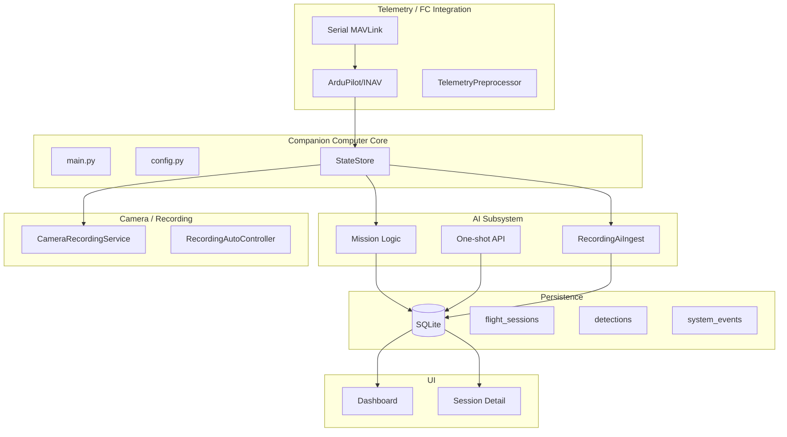

# System Coherence Review

Holistic architecture review of AirAutomatica. Companion-computer application for MAVLink-capable aircraft (primary: fixed-wing UAV/RC). This document helps reconnect major subsystems into one understandable whole.

---

## 1. Current System Map

### Subsystem Roles

| Subsystem | Location | Role |
|-----------|----------|------|
| **Companion core** | `main.py`, `config.py`, `services/state_store.py` | Entry point, config, shared aircraft state |
| **Telemetry / FC** | `telemetry/` | MAVLink over serial, adapters (ArduPilot/INAV), capabilities, preprocessing |
| **Session lifecycle** | `services/session_auto_controller.py`, `services/persistence.py` | Session start/stop, session-scoped persistence |
| **Camera / Recording** | `services/camera_recording.py`, `services/recording_ai_ingest.py` | rpicam-vid, Hailo overlay, recording-time AI persistence |
| **AI HAT** | `ai/hailo_detection*.py`, `ai/providers/hailo_provider.py` | One-shot detection, capability, diagnostics |
| **Mission logic** | `services/mission_logic.py` | Telemetry-driven inference (mock/ollama/aihat), insert_detection |
| **Persistence** | `db/`, `services/persistence.py`, `services/persistence_recorders.py` | SQLite, sessions, detections, events, phases |
| **UI** | `ui/`, `realtime/` | Dashboard (Live, Session History, Settings), session detail, Socket.IO |
| **Packaging** | `packaging/` | systemd, .deb, install scripts, `/etc/airautomatica/` |

---

## 2. Subsystem Status Table

| Subsystem | Status | Notes |
|-----------|--------|-------|
| **Companion core** | Solid | Clear init flow, config layering, graceful shutdown |
| **Telemetry / FC** | Solid | MAVLink parsing, adapters, capabilities, reconnect |
| **Session lifecycle** | Solid | Session-scoped persistence, auto-start on arm |
| **Camera / Recording** | Usable but rough | Recording works; AI overlay and ingest have config complexity |
| **AI HAT** | Solid | One-shot, recording-time, source attribution, diagnostics |
| **Mission logic** | Solid | Dedupe, confidence threshold, telemetry context |
| **Persistence** | Solid | WAL, graceful degradation, clear schema |
| **Events / Detections** | Solid | Evidence vs notification, source_backend, fmtSourceBackend |
| **UI** | Usable but rough | Functional; some subtitles stale, session-review could be clearer |
| **Packaging** | Usable but rough | .deb works; AI HAT setup scattered across scripts |
| **Documentation** | Fragmented | Core docs indexed; architecture/review docs orphaned |

---

## 3. Workflow Review

### Bench Workflow

1. Boot Pi → start airautomatica service
2. Connect FC / telemetry → verify health, capabilities
3. Verify AI HAT (optional) → status, one-shot test
4. Start session → Operations → Start Session
5. Start recording → Camera Ready, Start Recording
6. Observe detections/events → Recent Detections, Recent Events
7. Review session results → Session History → click session

**Clear:** Session vs recording controls, AI HAT status, source labels per detection.
**Awkward:** Session History is a separate tab; no quick link from Live to past sessions.
**Missing:** Single "what happened in this run?" summary at top of session detail.

### AI HAT Workflow

1. Capability/status → Connection & Health → AI HAT section
2. One-shot testing → Run one-shot detection
3. Recording-time persistence → When recording + overlay + persist enabled
4. Operator understanding → Recent Detections shows source per card

**Clear:** One-shot vs persisted history, source labels (AI HAT one-shot, AI HAT recording, Mission).
**Awkward:** Recording-time requires overlay + persist; config spread across env vars.

### Session Review Workflow

1. What happened? → Session detail: path, debrief, detections, recordings
2. What was recorded? → Recordings section, video player
3. What detections/events? → Detections list, Replay timeline
4. Interpretability → Debrief metrics, AI summary, clickable events

**Clear:** Path, replay, debrief, detections with source.
**Awkward:** Subtitle omits recordings; stats omit recording count.
**Missing:** At-a-glance summary (duration, detections, recordings) could be more prominent.

### Packaging / Setup Workflow

1. Install .deb → `sudo dpkg -i airautomatica_*.deb`
2. Configure → `/etc/airautomatica/airautomatica.env`
3. AI HAT (optional) → `install-ai-hat-deps.sh`, `install-ai-hat-apps.sh`

**Clear:** Default mock mode, env precedence, apply modes.
**Awkward:** AI HAT setup requires multiple scripts; hailo-apps clone path.

---

## 4. Semantics Review

| Term | Definition | Consistency |
|------|------------|-------------|
| **Session** | Flight session; telemetry + detections scope | Consistent |
| **Recording** | Video recording; distinct from session | Consistent |
| **Detection** | Persisted perception result; evidence | Consistent |
| **Event** | System event (notification) vs flight event (EventEngine) | Consistent; "event" overloaded but context clarifies |
| **Evidence** | Detection row; durable, session-linked | Internal; not user-facing |
| **Notification** | System event; log-style | Internal; not user-facing |
| **One-shot** | AI HAT on-demand | Consistent |
| **Recording-time AI** | `ai_hat_recording` during recording | Consistent |
| **Mission-flow** | mock/ollama/aihat from MissionLogic | Consistent |
| **Health** vs **Diagnostics** | Health = readiness; diagnostics = troubleshooting | Separated |

**Places needing cleanup:** dashboard.md "Recent Detections" says mission-flow only (stale); ai_hat_scope glossary "Persisted detection history" omits recording-time and one-shot.

---

## 5. Aviation Alignment

| Feature | Classification |
|---------|----------------|
| Flight status strip, attitude, home, altitude, speed, power | Operator-facing aviation value |
| Autopilot capabilities, telemetry lifecycle | Mission-context value |
| Debrief, replay, phase intervals | Mission-context value |
| Detections with telemetry context (lat/lon/alt) | Mission-context value |
| AI Telemetry Summary, Event Classification | Mission-context value |
| Health, diagnostics | Internal/debug |
| Settings apply modes, hot-reload | Internal/debug |
| Command policy (future FC commands) | Future automation candidate |

---

## 6. Major Gaps

### Documentation Gaps

- Architecture and review docs (event_detection_review, ai_hat_scope, detection_usability_plan) not indexed in docs/README
- dashboard.md "Recent Detections" description stale (mission-flow only)
- ai_hat_scope glossary "Persisted detection history" incomplete

### UX Clarity

- Session detail subtitle omits recordings
- Recent Detections subtitle omits one-shot (aihat) when session active
- Session detail stats omit recording count

### Intentional Deferrals

- Session filter for get_recent_system_events (global events correct for app_shutdown, etc.)
- Event batching / rate limiting for recording-time detections
- "Interesting event" promotion

---

## 7. Recommended Cleanup Priorities

1. **Index architecture docs** — Add Architecture & Reviews section to docs/README
2. **Fix dashboard.md** — Update Recent Detections to include recording-time and one-shot
3. **Session detail subtitle** — Add recordings
4. **Recent Detections subtitle** — Add one-shot (aihat) when session active
5. **ai_hat_scope glossary** — Update Persisted detection history
6. **Session detail stats** — Add recording count to at-a-glance

---

## 8. Recommended Next Feature Priorities

1. **Session evidence summary** — Stronger "what happened?" at top of session detail
2. **Confidence/source-aware event presentation** — Filter or group by source in session review
3. **Recording-linked detection playback** — Seek video to detection timestamp
4. **Mission-assist summaries** — Richer post-flight AI summary
5. **Source-specific notification policies** — Future: promote high-confidence aircraft_detected

---

## 9. Implemented Improvements (This Pass)

1. **docs/README.md** — Added "Architecture & Reviews" section indexing system_coherence_review, event_detection_review, ai_hat_scope, detection_usability_plan.
2. **docs/dashboard.md** — Updated "Recent Detections" description to include recording-time AI and one-shot (aihat) when session active.
3. **session_detail.html** — Subtitle broadened from "Flight path, telemetry trends, and detections" to "Flight path, telemetry, detections, and recordings".
4. **dashboard.html** — Recent Detections subtitle updated to include "one-shot (aihat) when session active".
5. **docs/ai_hat_scope.md** — Glossary "Persisted detection history" updated to include recording-time and one-shot sources.
6. **session_detail.html** — Added "Recordings" to at-a-glance stats grid (Path points, Detections, Recordings, First/Last, Altitude).

---

## 10. Deferred Items

- Session filter for get_recent_system_events
- Event batching / rate limiting for recording-time
- "Interesting event" promotion
- Full session evidence summary (beyond stats)

---

## 11. Final Summary

### What the system is now

AirAutomatica is a Raspberry Pi 5 companion-computer application for MAVLink-capable aircraft. It reads telemetry over serial, maintains shared aircraft state, runs optional AI perception (AI HAT, Ollama), records video with optional Hailo overlay, and persists sessions, detections, and events to SQLite. The UI provides a live dashboard and session detail pages for review. The Pi side is companion-only; the flight controller remains flight-critical.

### Where it is strongest

- **Telemetry:** Solid MAVLink integration, adapters, capabilities, reconnect.
- **Persistence:** Clear schema, WAL, graceful degradation, session-scoped data.
- **Detection/event semantics:** Evidence vs notification, source_backend, human-friendly labels.
- **AI HAT:** One-shot, recording-time, confidence thresholds, diagnostics distinct from health.
- **Aviation UI:** Flight status, attitude, home, altitude, speed, power.

### Where it is fragmented

- **Documentation:** Architecture and review docs were orphaned; now indexed.
- **Session review:** At-a-glance summary improved with recordings count; could be stronger.
- **Packaging:** AI HAT setup spread across scripts.

### What was improved in this pass

- Architecture docs indexed in docs/README.
- dashboard.md and dashboard.html Recent Detections descriptions updated.
- Session detail subtitle and stats updated (recordings).
- ai_hat_scope glossary corrected.
- New anchor document (this file) for whole-system understanding.

### What should come next

1. Stronger session evidence summary (optional).
2. Recording-linked detection playback (seek video to detection time).
3. Source-specific filtering in session review.
4. Consolidate AI HAT setup guidance.
